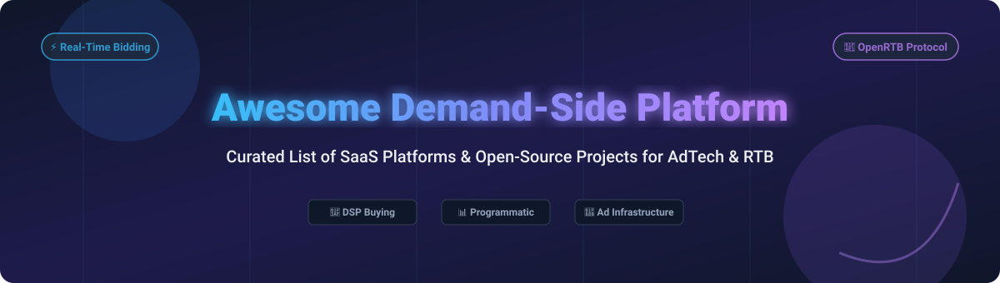

# Awesome Demand-Side Platform (DSP) Ecosystem 🚀

  
  
  
  
  

---

## 📌 Overview & Market Insights

A curated list of top **Demand-Side Platforms (DSP)**, **Real-Time Bidding (RTB)** bidders, **OpenRTB protocol frameworks**, and **Programmatic Advertising** tools for ad tech engineers, growth marketers, and media buyers.

> 💡 **Market Size & Structure**: The global Demand-Side Platform (DSP) market is estimated at **$30.8 Billion in 2026** and projected to reach **$85+ Billion by 2032** (CAGR ~18.5%). The market is **highly concentrated (tier-1 winner-take-most)** at the enterprise tier (dominated by Google DV360, The Trade Desk, and Amazon DSP holding >60% market share), while remaining **moderately fragmented** in niche verticals (CTV, mobile app user acquisition, regional/geo-fenced ad tech).

---

## 📑 Table of Contents

- [🏢 SaaS & Commercial Platforms](#-saas--commercial-platforms)
- [🔓 Open-Source GitHub Projects](#-open-source-github-projects)
- [🤝 How to Contribute](#-how-to-contribute)
- [💖 Support & Community](#-support--community)
- [⚠️ Disclaimer](#%EF%B8%8F-disclaimer)
- [📈 Star History](#-star-history)

---

## 🏢 SaaS & Commercial Platforms

Commercial Demand-Side Platforms provide direct access to global ad exchanges, supply-side platforms (SSPs), proprietary audience identity graphs, machine learning bidding engines, and brand safety controls.

| Platform | Description | Pricing Model & Starting Tier | Free Tier / Trial Limit | Scale & Valuation / Revenue |
| :--- | :--- | :--- | :--- | :--- |
| **[Amazon DSP](https://advertising.amazon.com/)** 🛒 | Enterprise omnichannel & retail media DSP leveraging Amazon shopping data. | Managed service min. $35,000–$50,000/mo spend; Self-serve via select partners. | No free trial (Registration free, minimum spend required for live campaigns). | Market Cap **~$2.2 Trillion** (Amazon parent); Advertising Revenue **~$50B/yr**. |
| **[Google DV360](https://displayvideo.google.com/)** 🌐 | Enterprise DSP integrated with Google Marketing Platform and YouTube inventory. | Direct contracts min. $100,000+/mo spend; Partner resellers offer lower commitments. | No free trial (Enterprise demo & agency sandbox available upon request). | Market Cap **~$2.1 Trillion** (Alphabet); Google Network/DV360 Revenue **~$30B+/yr**. |
| **[The Trade Desk](https://www.thetradedesk.com/)** 📈 | Independent programmatic DSP specializing in Connected TV (CTV) and audio. | Direct enterprise seats min. $20,000–$100,000/mo media spend. | No free trial (Free access to Edge Academy learning platform). | Market Cap **~$6.0 Billion**; FY2025 Revenue **$2.90 Billion**. |
| **[Yahoo DSP](https://www.yahooinc.com/)** 🟣 | Omnichannel DSP powered by Yahoo native data and premium identity graph. | Direct enterprise minimums starting at $10,000/mo spend. | No free trial (Self-serve demo environment upon sales approval). | Private company; Estimated Valuation **~$8.0 Billion** (Apollo Global); Revenue **~$4.5B/yr**. |
| **[Viant Technology](https://www.viantinc.com/)** 📺 | People-based autonomous DSP powered by Adelphic identity graph and CTV focus. | Self-serve min. $2,500/mo spend; Enterprise custom tiers available. | No free trial (Interactive platform walk-through available). | Public (NASDAQ: DSP); Market Cap **~$650 Million**; Annual Revenue **~$270 Million**. |
| **[Adform](https://adform.com/)** 🇪🇺 | European full-stack advertising engine combining DSP, DMP, and Ad Server. | Custom platform fee structure starting at ~$5,000/mo spend commitment. | No free trial (14-day guided sandbox demo for qualified agencies). | Private company; Estimated Valuation **~$450 Million**; Annual Revenue **~$120 Million**. |
| **[Basis Technologies](https://basis.com/)** 📊 | Programmatic DSP integrated with agency workflow automation and media planning. | Minimum monthly platform spend ~$5,000/mo for agency direct accounts. | No free trial (Free product demonstration & workflow audit). | Private company; Estimated Valuation **~$400 Million**; Annual Revenue **~$180 Million**. |
| **[Smadex](https://smadex.com/)** 📱 | Mobile-first DSP for mobile app user acquisition and programmatic retargeting. | Minimum monthly ad spend starting at $5,000/mo for performance campaigns. | No free trial (Dedicated account setup with performance guarantee terms). | Private subsidiary (Entravision); Parent Market Cap **~$150 Million**; Unit Revenue **~$60M/yr**. |
| **[StackAdapt](https://www.stackadapt.com/)** 🚀 | Multi-channel self-serve DSP with no strict minimum spend requirements. | No platform subscription fees; Pay-as-you-go starting at $500 initial deposit. | No free trial (Free instant account creation with self-serve dashboard access). | Private company; Estimated Valuation **~$350 Million**; Annual Revenue **~$100M+**. |
| **[Simpli.fi](https://simplifi.fi)** 📍 | Geo-fencing and localized unstructured data DSP for agencies and local brands. | Flexible SMB plans starting at $1,000/mo spend minimum. | No free trial (Custom geo-fencing demo & localized audience mapping free). | Private equity backed (GTCR/Blackstone); Estimated Valuation **~$1.5 Billion**. |

---

## 🔓 Open-Source GitHub Projects

Open-source Demand-Side Platforms, OpenRTB protocol specifications, header bidding engines, and ad server infrastructure. Sorted by GitHub_Stars (descending).

- **[Prebid.js](https://github.com/prebid/Prebid.js)**  ⚡  
  **The leading open-source header bidding library for web browsers.** Enables publishers to setup concurrent auctions across demand partners before calling the ad server. Written in JavaScript.

- **[Revive Adserver](https://github.com/revive-adserver/revive-adserver)**  🎯  
  **The world's most popular free open-source ad serving system.** Provides campaign management, ad targeting, impression tracking, and yield optimization. Written in PHP.

- **[RTBKit](https://github.com/rtbkit/rtbkit)**  🛠️  
  **Open-source software framework for creating Real-Time Bidders.** Designed for low-latency ad exchanges and DSP bidder development. Written in C++. *(Historical reference framework)*.

- **[OpenRTB Specification](https://github.com/openrtb/OpenRTB)**  📖  
  **Official standard specification repository for OpenRTB by IAB Tech Lab.** Defines protocol schemas and communication standards between supply and demand systems.

- **[Prebid Server](https://github.com/prebid/prebid-server)**  🌐  
  **Open-source server-to-server header bidding engine.** Supports OpenRTB bid adapters across CTV, mobile apps, and web environments. Written in Go (Java version also available).

- **[vanilla-rtb](https://github.com/venediktov/vanilla-rtb)**  ⚡  
  **C++ Real-Time Bidding (RTB) Demand-Side Platform framework.** Extremely high-performance bidder architecture optimized for sub-10ms response times.

- **[OpenRTB Go Library](https://github.com/bsm/openrtb)**  🐹  
  **Lightweight OpenRTB protocol parsing and serialization library for Go.** Fast JSON encoding/decoding for RTB request/response objects.

- **[OpenRTB Models for Java](https://github.com/openrtb/openrtb2x)**  ☕  
  **OpenRTB model implementation in Java using Protocol Buffers.** Official Java library providing JSON serialization helpers and proto schemas.

- **[OpenRTB Go Definitions](https://github.com/mxmCherry/openrtb)**  🛠️  
  **Actively maintained OpenRTB v2.x & v3.0 Go types and validation library.** Essential building block for modern Go DSP bidders.

- **[OpenDSP](https://github.com/javagossip/opendsp)**  📱  
  **Mobile DSP advertising platform with built-in ADX integrations and management dashboard.** Full-stack mobile ad buying platform. Written in Java.

- **[RTB4FREE Bidder](https://github.com/RTB4FREE/bidder)**  🆓  
  **Complete open-source DSP bidder framework in Java.** Features OpenRTB compliance, campaign budget pacing, geo-targeting, and UI manager integration.

---

## 🤝 How to Contribute

Contributions are welcome! Help us keep this directory accurate and up to date.

1. **Fork** this repository.
2. Add or update entries in `README.md` following the tabular and Stars_Badge formats.
3. Ensure links, pricing, scale metrics, and GitHub links are verified.
4. Submit a **Pull Request** with a brief summary of additions.

---

## 💖 Support & Community

If you find this repository helpful, please consider supporting the project:

- ⭐ **Star** this repository to show appreciation.
- 🔀 **Fork** and share with fellow AdTech engineers and marketers.
- 💬 Join the discussion on our [Discord Community](https://discord.gg/jc4xtF58Ve).
- ☕ **Buy a coffee & Sponsor**: [GitHub Sponsors Dashboard](https://github.com/sponsors/ishandutta2007)

Thank you for supporting open-source AdTech documentation! ❤️

---

## ⚠️ Disclaimer

- This directory is community-curated for informational and educational purposes.
- Commercial DSP minimums and pricing models vary by contract terms, regions, and reseller partnerships.
- Ensure full compliance with regional privacy laws (GDPR, CCPA, CPRA) and ad tech standards when handling audience data and real-time bidding protocols.

---

## 📈 Star History

